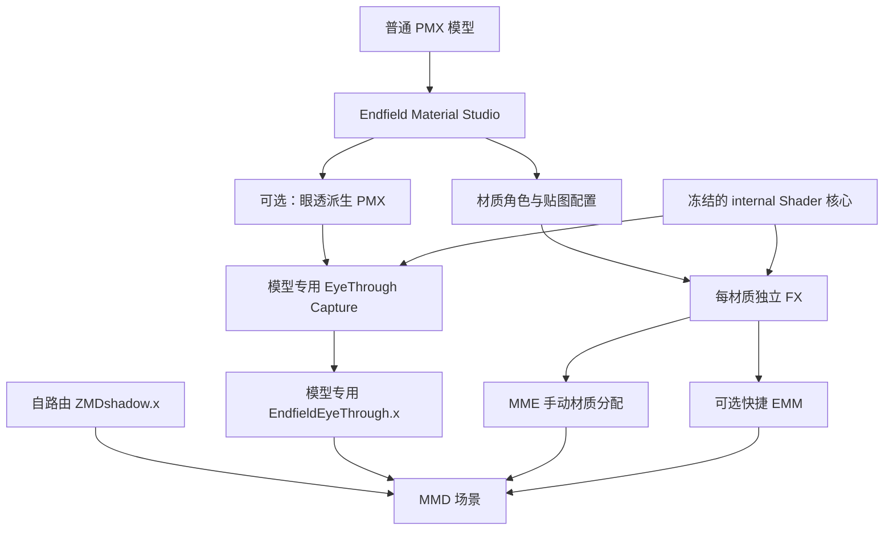

# Endfield Material Studio 类 StarRail 工作流重构计划

日期：2026-08-09  
状态：待实施  
范围：GUI、材质 FX 生成、阴影/眼透装配流程  

## 1. 重构结论

采用类似 `MMDStarRail4Fun` 的“每个部位/材质独立 FX”方案，但保留 GUI 负责以下复杂工作：

- 读取 PMX 和材质列表。
- 自动分类材质并允许用户校正。
- 匹配、复制和改写贴图路径。
- 安全生成眼透派生 PMX。
- 生成模型专用的眼透 Capture FXSUB。
- 输出材质映射清单和可选 EMM。

EMM 从必需运行条件降级为可选快捷功能。材质 FX、阴影附件和眼透附件在不加载 EMM 时也必须能够独立工作。

## 2. 不变原则

1. 冻结当前 `EndfieldMME` 中已经验证可用的渲染算法，不在 GUI 重构期间调整画面参数。
2. 原始 PMX 永不覆盖，派生模型输出到新文件。
3. 一个 PMX 材质对应一个清晰、可直接编辑的 FX。
4. 生成文件只使用相对资源路径，整个角色包移动后仍可使用。
5. 固定运行时资产与角色贴图分离，避免重复复制和隐私路径泄漏。
6. EMM 失败不能导致材质、阴影和眼透全部失效。
7. 所有自动判断都必须允许用户在 GUI 中覆盖。

## 3. 目标架构



职责分层：

- **Shader Core**：`internal/*.hlsl`、控制器、固定公共贴图，只由开发者维护。
- **Material FX**：角色专用贴图路径和少量可调参数，允许用户直接编辑。
- **Global Modules**：ZMD 阴影、眼透、后处理，独立加载。
- **Optional Automation**：EMM 只负责节省手动分配时间。

## 4. 目标输出结构

```text
角色名_Endfield/
  Model/
    角色名_Endfield.pmx
    角色名_Endfield_EyeThrough.pmx       # 仅启用眼透时生成
    原模型使用的贴图依赖/

  Material_000_Face.fx
  Material_001_Iris.fx
  Material_002_EyeHighlight.fx
  Material_003_EyeWhite.fx
  Material_007_Hair.fx
  Material_009_Skin.fx
  Material_010_Cloth.fx

  ZMDshadow.x
  ZMDshadow.fx
  ZMDshadow_ShadowMap.fxsub
  ZMDshadow_ViewportMap.fxsub

  EndfieldEyeThrough.x                   # 仅启用眼透时生成
  EndfieldEyeThrough.fx
  EndfieldEyeThrough_Capture.fxsub
  EndfieldEyeThrough_Mask.fxsub

  internal/
  controller/
  textures/common/
  textures/character/

  材质映射说明.txt
  material-map.json
  角色名_快捷映射.emm                    # 可选，默认不作为必要文件
  使用说明.txt
```

内部文件名尽量使用 ASCII；中文名称保留在 GUI、说明文档和 PMX 内部显示名中，降低 CP932/CP936 和路径编码风险。

## 5. 材质 FX 方案

### 5.1 生成规则

- 每个已启用的 PMX 材质生成一个 FX。
- 文件名包含稳定的三位材质索引和角色名。
- FX 顶部只保留用户需要修改的贴图与参数区。
- 渲染实现统一 `#include` 对应的 `internal/*.hlsl`。
- 所有贴图引用使用角色包内相对路径。

示例：

```hlsl
// ===== 用户配置区 =====
#define EF_MAIN_TEXTURE_RESOURCE "textures/character/m007_base.png"
#define EF_NORMAL_TEXTURE "textures/character/m007_normal.png"
#define EF_ORM_TEXTURE "textures/character/m007_property.png"
#define EF_RAMP_TEXTURE "textures/character/m007_rd.png"

#define EF_HAIR_HIGHLIGHT_INTENSITY 1.05
#define EF_CULL_MODE NONE
// ===== 用户配置区结束 =====

#include "internal/endfield_shader.hlsl"
```

### 5.2 GUI 材质角色

- 不使用 Shader
- 面部
- 头发
- 皮肤
- 衣服/通用物体
- 虹膜
- 眼白
- 眼睛高光
- 睫毛/眉毛
- 嘴部
- 发影
- 眼透覆盖层
- 眉睫覆盖层
- 隐藏材质

GUI 自动分类仅提供初始建议，用户确认后才生成。

### 5.3 手动映射清单

必须同时生成：

```text
#0  面部      -> Material_000_Face.fx
#1  目        -> Material_001_Iris.fx
#2  目高光    -> Material_002_EyeHighlight.fx
#3  目白      -> Material_003_EyeWhite.fx
#7  发        -> Material_007_Hair.fx
#9  身体      -> Material_009_Skin.fx
#10 衣装      -> Material_010_Cloth.fx
```

这样即使 EMM 完全失效，用户仍能在 MME 的效果分配窗口中完成上材质。

## 6. 阴影模块

目标：只加载 `ZMDshadow.x` 就能创建并填充阴影 RT，不依赖 EMM 中的 `Owner=Acs1`。

实施要求：

- 保留 `ZMDshadow_SMap` 与 `ZMDshadow_VMap` 的正式名称。
- 使用 `DefaultEffect` 自动处理普通 PMX。
- 自动隐藏所有 Endfield 控制器、后处理附件和眼透宿主附件。
- 面部材质默认只使用 SDF，不接收 ZMD 阴影。
- 头发、皮肤、衣服和普通物体默认接收 ZMD 阴影。
- 特殊透明材质允许用户选择是否参与阴影图。
- EMM 中不再重复声明阴影 RT 页面；仅在特殊覆盖时生成可选规则。

验收方式：新建空场景，仅载入 `ZMDshadow.x`、PMX 和材质 FX，衣服/皮肤必须出现阴影。

## 7. 眼透派生 PMX

眼透仍由 GUI 负责，因为它需要可靠识别并生成模型专用材质结构。

### 7.1 GUI 流程

1. 选择普通 PMX。
2. GUI 扫描虹膜、眼睛高光、眼白、睫眉、头发、发影和面部材质。
3. 用户确认源材质。
4. GUI 显示将要新增的覆盖材质和最终材质索引。
5. 点击“生成眼透派生 PMX”。
6. 输出新 PMX，原模型保持不变。
7. 自动更新当前工程中的材质索引和眼透 Capture 配置。

### 7.2 安全要求

- 不修改原始 PMX。
- 重复执行时识别已有覆盖材质，不能重复追加。
- 复制完整索引区间，不改变原材质三角面。
- 保留骨骼、Morph、刚体、Joint 和材质顺序。
- 检查源材质是否为空、重复或越界。
- 派生模型生成后重新读取并验证 PMX 结构。
- 输出源材质与派生材质对应表。

### 7.3 去除 EMM 依赖

为每个角色生成模型专用 `EndfieldEyeThrough.fx`：

- 通过 `DefaultEffect` 将目标派生 PMX 路由到该角色的 Capture FXSUB。
- 其他场景对象使用深度 Mask 或隐藏策略。
- 自动隐藏控制器和眼透宿主自身。
- Capture 内继续使用 GUI 生成的材质 subset 列表。

首个正式版本限定：一个场景只启用一个眼透角色。多角色眼透需要为 RenderTarget 和共享变量生成唯一名称，作为后续版本处理。

## 8. EMM 定位

EMM 默认关闭生成，用户可勾选“生成当前角色快捷 EMM”。

快捷 EMM：

- 只作为全新空场景的一键辅助。
- 明确提示它包含绝对路径和对象槽位。
- 不能成为阴影或眼透运行的必要条件。
- 生成后必须同时保留手动材质映射说明。
- GUI 不再宣称 EMM 可以自动加载模型和附件。

## 9. GUI 精简

建议保留四个主页面：

1. **工程**：PMX、运行时目录、输出目录。
2. **材质**：材质列表、角色类型、基础色和角色专用贴图。
3. **眼透**：源材质选择、派生 PMX 预览与生成。
4. **生成**：校验结果、输出内容和可选 EMM。

需要移除或降级：

- 不稳定的高速材质球切换预览。
- 大量不影响打包的高级参数控件。
- 依赖对象顺序的隐式自动操作。

需要增加：

- “打开生成的 FX”按钮。
- “复制 FX 路径”按钮。
- 必需贴图、可选贴图和回退行为说明。
- 材质重复绑定、漏绑定和索引变化提示。
- 眼透派生前后的材质差异预览。
- 生成完成后的最短加载顺序说明。

## 10. 实施阶段

### P0：冻结与清理

- [ ] 将当前可用 `EndfieldMME` 复制为只读 Golden Runtime。
- [ ] 生成 SHA256 清单。
- [ ] 禁止 GUI 重构修改画面算法参数。
- [ ] 统一 GitHub 与本地源码，旧 `EndfieldShaderTool` 标记为 Legacy。
- [ ] 修复 GitHub 当前错误的 ZMD RenderTarget 页面名称。
- [ ] 补齐缺失的 `internal/endfield_hidden.hlsl`。
- [ ] 确保远端全部自检通过。

### P1：独立材质 FX

- [ ] 重写材质 FX 输出器。
- [ ] 每个材质生成独立 FX。
- [ ] 使用相对贴图路径。
- [ ] 生成 `material-map.json` 和中文映射说明。
- [ ] 无 EMM 状态下完成手动分配测试。

### P2：自路由阴影

- [ ] 整理 ZMD `DefaultEffect` 规则。
- [ ] 排除控制器和辅助附件。
- [ ] 验证衣服、皮肤、头发和普通物体阴影。
- [ ] 验证面部仍只使用 SDF。

### P3：眼透工作流

- [ ] 加固派生 PMX 的幂等生成。
- [ ] 生成模型专用 Capture FXSUB。
- [ ] 生成模型专用 EyeThrough FX 和自动路由规则。
- [ ] 无 EMM 状态下验证眼透。
- [ ] 验证其他人物、耳朵、脖子和背景不会错误透过。

### P4：可选 EMM

- [ ] 重新实现快捷 EMM。
- [ ] 检查 RT 名称与 Owner。
- [ ] 对路径不一致和对象顺序变化给出明确警告。
- [ ] EMM 失败时确保手动方案仍然可用。

### P5：GUI 与稳定性

- [ ] 将界面精简为四个主页面。
- [ ] 所有耗时操作增加取消、去抖和异常隔离。
- [ ] 快速切换材质不会并发读取或修改同一工程状态。
- [ ] 生成操作采用临时目录和原子替换。

### P6：通用模型验证

- [ ] 陈千语：完整眼透、SDF、发影、皮肤和衣服。
- [ ] 李织烟：缺少部分 MatCap 时正确回退。
- [ ] 梨诺：验证不同材质命名和数量。
- [ ] 祀：验证另一套贴图组合。
- [ ] 至少一个非茶叶味香皂来源的普通 PMX。
- [ ] 移动整个输出文件夹后重新载入测试。

### P7：发布

- [ ] EXE、Shader Runtime 与源码来自同一个提交。
- [ ] 发布包内记录 Git commit 和资产 SHA256。
- [ ] README 同时提供手动方案和快捷 EMM 方案。
- [ ] 提供从普通 PMX 到眼透派生 PMX 的完整教程。
- [ ] 更新第三方参考、致谢和许可证说明。

## 11. 最终验收标准

- [ ] 不加载 EMM，也能手动分配全部材质 FX。
- [ ] 只加载 `ZMDshadow.x` 即能生成阴影数据。
- [ ] 眼透附件与派生 PMX组合后，不依赖 EMM 即可工作。
- [ ] 面部仅使用 SDF；其他指定部位正常接收阴影。
- [ ] 发影、眼睛、眼白、睫毛和眉毛层级正确。
- [ ] 原始 PMX 从未被覆盖。
- [ ] 派生 PMX 重复生成不会增加重复材质。
- [ ] 缺少可选 MatCap、Normal、Property 或自发光贴图时不报致命错误。
- [ ] 输出包移动到其他目录后仍可使用。
- [ ] 所有测试通过，MME 日志无编译错误。
- [ ] GitHub 源码、Release EXE 和 ShaderTemplate 内容一致。

## 12. 推荐执行顺序

先完成 P0 和 P1，确认独立材质 FX 可以稳定手动使用；然后完成 P2 阴影自路由；最后处理 P3 眼透自动路由。可选 EMM 和界面美化放到核心流程可靠之后。

